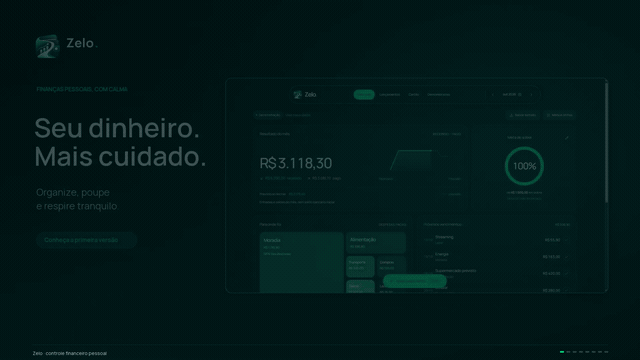
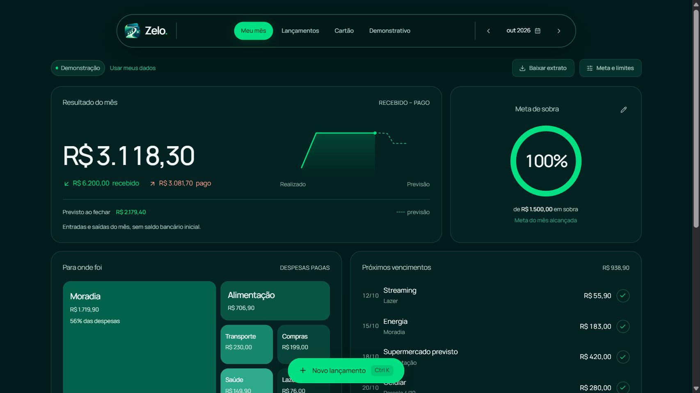
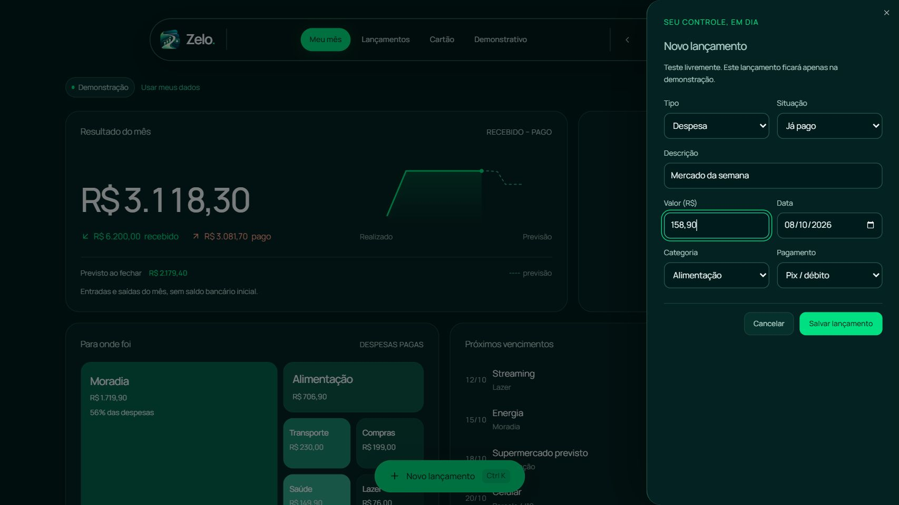
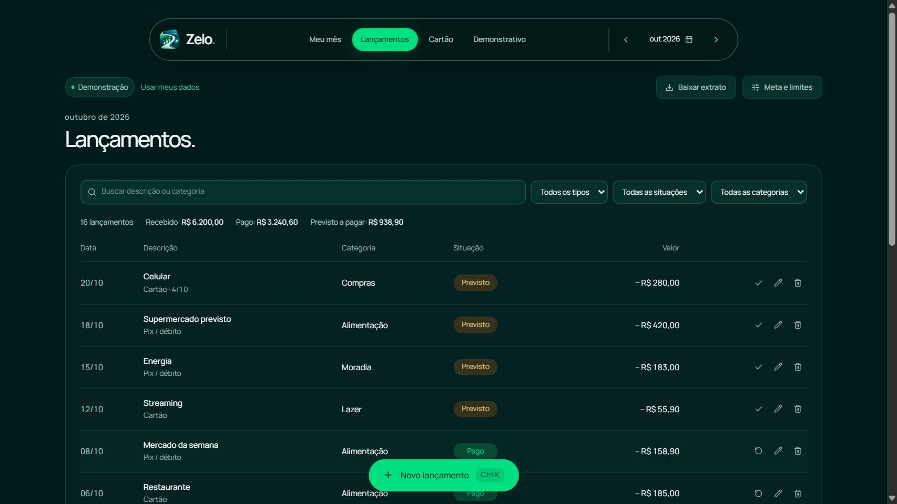
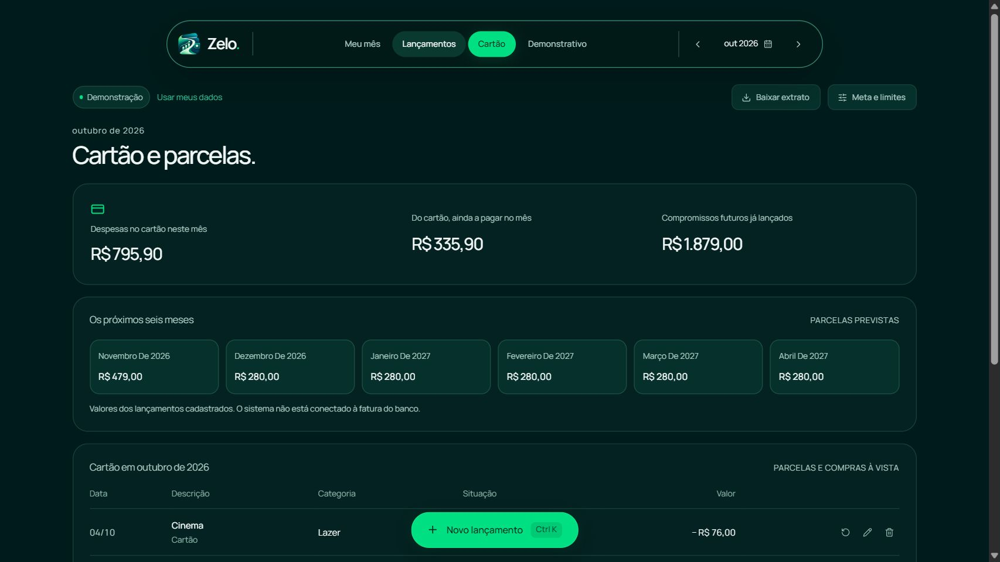
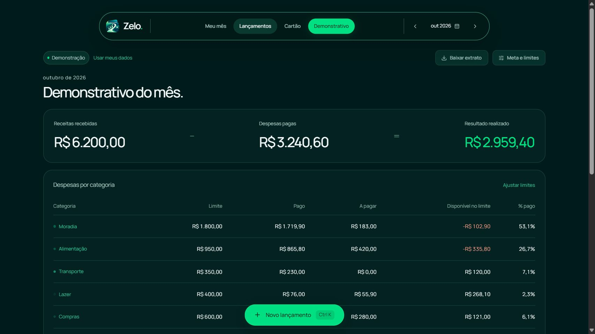
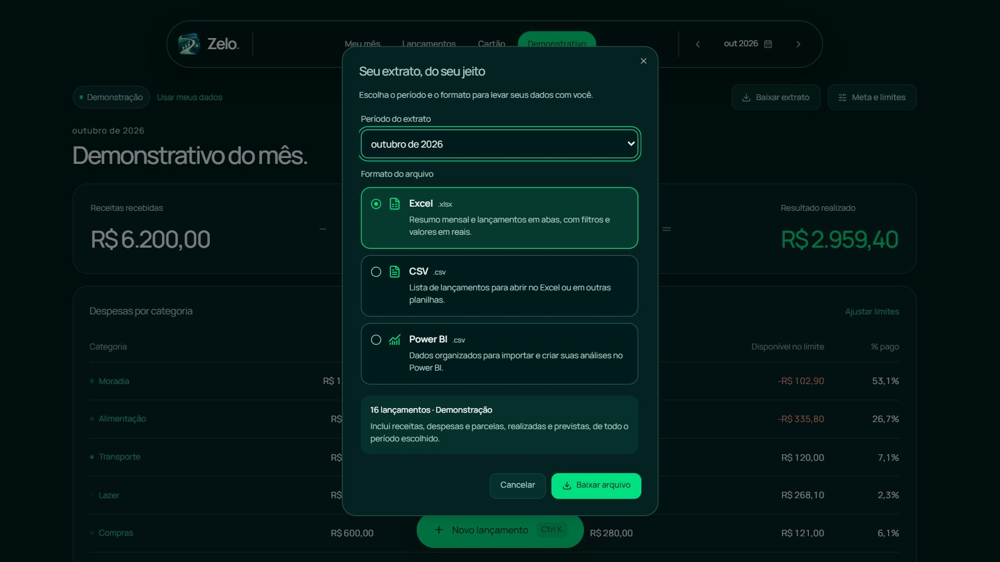

# Zelo — finanças pessoais

> **Branch `demo/vercel`: demonstração pública para portfólio.** A aplicação em `demo/` usa valores fictícios e mantém as alterações apenas na memória da aba. Recarregar a página ou clicar em **Reiniciar demonstração** restaura os exemplos. A `main` continua com a versão original do sistema.
>
> **Deploy na Vercel:** siga o [guia da demonstração](docs/DEMO-VERCEL.md). Use **Root Directory `demo`** e habilite o acesso aos arquivos compartilhados fora dessa pasta.

O Zelo ajuda a organizar receitas e despesas, entender para onde o dinheiro está indo e encontrar espaço no orçamento para economizar. O sistema está em português, com visual escuro, paleta verde e telas adaptadas para computador e celular.

O nome do sistema é **Zelo**, mas a pasta do projeto pode continuar como `folga-financas`.

## Experimente a demonstração

Esta branch permite apresentar o Zelo sem criar conta, configurar banco ou acessar registros pessoais. O selo **Demonstração** permanece ativo e a opção **Usar meus dados** não aparece nessa aplicação.

1. Explore **Meu mês**, **Lançamentos**, **Cartão** e **Demonstrativo**. No celular, use o menu hambúrguer.
2. Use **Novo lançamento** para testar receitas, despesas e compras parceladas. Edite, exclua ou marque os registros como realizados e previstos.
3. Ajuste **Meta e limites** e veja os totais responderem às alterações.
4. Em **Baixar extrato**, escolha o mês ou o histórico e baixe **XLSX**, **CSV** ou **CSV para importar no Power BI**. Os arquivos recebem `demonstracao` no nome; não é gerado um projeto `.pbix`.
5. Clique em **Reiniciar demonstração** para voltar aos exemplos e ao mês inicial. Recarregar ou fechar a aba também descarta as alterações de teste.

| Comportamento | Demonstração em `demo/` | Sistema original na raiz |
| --- | --- | --- |
| Dados | Exemplos fictícios e testes da aba | Registros do usuário no modo pessoal |
| Persistência | Apenas memória; recarregar restaura exemplos | API e banco SQLite / Cloudflare D1 |
| Conta e login | Não exige conta nem implementa login | Login próprio ainda não integrado |
| Hospedagem | Arquivos estáticos com React e Vite | Vinext e Cloudflare Workers |

Para executar a demonstração localmente, com **Node.js 22.13 ou superior**:

```powershell
cd demo
npm.cmd ci
npm.cmd run dev
```

Abra o endereço informado pelo terminal. Em Linux e macOS, use `npm` no lugar de `npm.cmd`. A pasta `demo` usa componentes e recursos da raiz; mantenha o repositório completo. Instruções de build e publicação estão no [guia da Vercel](docs/DEMO-VERCEL.md).

## Versão inicial

**v0.1.0 — MVP de controle financeiro pessoal.** Esta primeira versão reúne dashboard, lançamentos, parcelas, metas, demonstrativo e exportação de extratos. No sistema original, o uso local possui armazenamento persistente; a aplicação `demo/` desta branch é temporária. Cadastro, login próprio e acesso público para outros usuários estão nas próximas etapas.

A revisão da primeira versão, os testes executados e as limitações conhecidas estão em [Avaliação da v0.1.0](docs/AVALIACAO-v0.1.0.md).

## Veja o Zelo em funcionamento

Um motion de **40 segundos**, em formato horizontal, mostra o dashboard, o cadastro de um gasto, os lançamentos, o cartão, o demonstrativo e as opções de exportação. As imagens são **capturas reais do sistema**, com dados fictícios do modo Demonstração. O vídeo tem legendas explicativas e não possui áudio.



🎬 [Assistir ou baixar o vídeo em Full HD (.mp4)](https://github.com/ocaiofirmino/zelo-financas/raw/refs/heads/main/docs/media/zelo-motion.mp4) · [Ver o pôster](docs/media/zelo-motion-poster.png)

<details>
<summary>Ver as capturas reais e o que cada tela faz</summary>

### Meu mês

Resultado realizado e previsto, meta de sobra, categorias e próximos vencimentos.



### Novo lançamento

Registro de receitas ou despesas com descrição, valor, data, categoria, pagamento e situação. No exemplo do motion, foi cadastrado um gasto fictício de R$ 158,90, apenas na demonstração.



### Lançamentos

Busca, filtros e ações para conferir, editar ou excluir registros.



### Cartão e parcelas

Compras cadastradas manualmente, parcelas do mês e compromissos futuros.



### Demonstrativo

Receitas, despesas, resultado e comparação dos gastos com os limites por categoria.



### Exportação

Seleção do período e do formato Excel, CSV ou CSV preparado para importar no Power BI.



</details>

## Intuito do sistema

O Zelo foi criado para facilitar o cuidado com o dinheiro no dia a dia. Ao registrar o que você recebe e gasta, fica mais fácil entender seus hábitos, lembrar das contas que ainda vão vencer e planejar quanto pretende deixar de sobra no mês.

A ideia de uso é simples: **registrar, acompanhar e ajustar**. Você registra as movimentações, acompanha o resultado e as categorias e ajusta seus próximos gastos conforme a sua realidade. Por exemplo, ao perceber que Alimentação está consumindo boa parte do orçamento, pode definir um limite para acompanhar essa categoria.

O sistema ajuda a responder três perguntas: **quanto entrou, para onde foi e quanto está previsto sobrar?** O nome Zelo representa esse cuidado contínuo com as finanças. Nesta versão, você faz os registros manualmente; as dicas automáticas de economia ficam para uma etapa futura.

## O que o sistema faz

| Tela | Função |
| --- | --- |
| **Meu mês** | Resultado realizado e previsto, evolução do mês, meta de sobra, despesas por categoria, próximos vencimentos e últimos lançamentos. |
| **Lançamentos** | Cadastro, edição e exclusão de receitas e despesas, com busca e filtros por tipo, categoria e situação. |
| **Cartão** | Acompanhamento das compras cadastradas manualmente e das parcelas distribuídas pelos meses seguintes. |
| **Demonstrativo** | Resumo por categoria, receitas por origem, limites de gasto e comparação com o mês anterior. |

Também é possível definir uma **meta de sobra mensal**, configurar **limites por categoria** e **baixar extratos em XLSX ou CSV**, incluindo uma versão preparada para o Power BI.

## Tutorial simples: seu primeiro mês no controle pessoal

Os passos abaixo descrevem o sistema original executado pela raiz do repositório, com banco local. Para a aplicação temporária de portfólio, siga [Experimente a demonstração](#experimente-a-demonstração).

1. **Entre no seu controle.** Se aparecer o selo **Demonstração**, clique em **Usar meus dados**. O selo passa a indicar **Meu controle**. Para conhecer as telas antes de cadastrar seus gastos, use **Ver demonstração**; os exemplos são fictícios e ficam separados dos seus dados.
2. **Escolha o mês.** Use a data no cabeçalho para selecionar o período que deseja organizar. No celular, as telas ficam no menu hambúrguer.
3. **Cadastre o que recebeu.** Clique em **Novo lançamento**, selecione **Receita** e preencha descrição, valor, data, categoria e pagamento. Para um salário já recebido, escolha a categoria **Salário** e a situação **Já recebido**. Clique em **Salvar lançamento**.
4. **Cadastre o que gastou.** Abra **Novo lançamento** novamente e escolha **Despesa**. Informe os dados, selecione a categoria correspondente — como Moradia ou Alimentação — e use **Já pago** quando a conta já estiver quitada. Salve o lançamento.
5. **Anote as próximas contas.** Cadastre também as despesas que ainda não pagou, com a data de vencimento e a situação **Previsto**. Quando pagar, abra o registro em **Lançamentos**, edite a situação para **Já pago** e salve. Assim, ele passa de previsto para realizado.
6. **Veja o resultado.** Volte para **Meu mês**. **Resultado do mês** mostra o que já recebeu menos o que já pagou. **Previsto ao fechar** também considera as receitas e despesas previstas. Em **Para onde foi**, clique em uma categoria para consultar os gastos.
7. **Defina uma meta.** Em **Meta e limites**, informe quanto quer deixar de sobra no mês e, se desejar, um teto de gasto por categoria. Clique em **Salvar meta e limites**. A meta acompanha a sobra; guardar ou transferir esse dinheiro é uma ação que você realiza fora do sistema.
8. **Revise e baixe seu extrato.** Use **Lançamentos** para buscar ou corrigir registros, **Cartão** para acompanhar parcelas e **Demonstrativo** para conferir os totais por categoria. Em **Baixar extrato**, escolha o período e o formato Excel, CSV ou Power BI.

O atalho **Ctrl + K** — ou **Command + K** no Mac — também abre o formulário de lançamento.

### Exemplo prático

Imagine que você registrou estes quatro lançamentos no mesmo mês:

| Descrição | Tipo | Categoria | Situação no formulário | Valor |
| --- | --- | --- | --- | --- |
| Salário | Receita | Salário | Já recebido | R$ 3.000,00 |
| Aluguel | Despesa | Moradia | Já pago | R$ 1.200,00 |
| Mercado | Despesa | Alimentação | Já pago | R$ 300,00 |
| Energia | Despesa | Moradia | Previsto | R$ 200,00 |

O Zelo mostrará **R$ 3.000,00 recebidos**, **R$ 1.500,00 pagos** e um **resultado do mês de R$ 1.500,00**. Como ainda há R$ 200,00 de energia a pagar, o **previsto ao fechar será R$ 1.300,00**. Quando marcar a energia como paga, o resultado realizado também será R$ 1.300,00. Esses resultados consideram as movimentações cadastradas no mês, sem incluir um saldo bancário inicial.

Se cadastrar uma compra no cartão de **R$ 900,00 em 3 parcelas**, informe o **valor total da compra**, a quantidade de parcelas e a data de vencimento da primeira parcela no formulário. O sistema distribuirá três lançamentos de R$ 300,00 pelos meses correspondentes. Esse é um exemplo separado dos quatro registros acima.

### Uma rotina para manter o controle

Registre os gastos conforme acontecerem e reserve alguns minutos por semana para conferir contas previstas e categorias. Ao fechar o mês, consulte o Demonstrativo, veja quais gastos podem ser ajustados e defina sua meta para o próximo mês. Quanto mais completos estiverem os registros, mais útil será a previsão.

## Executar o sistema original no Windows e no VS Code

Requer **Node.js 22.13.0 ou superior**, com npm instalado. Abra a pasta do projeto no VS Code e use o terminal nessa pasta. Os comandos desta seção executam a versão com banco, pela raiz; para a demonstração da Vercel, execute os comandos dentro de `demo/` indicados no [guia](docs/DEMO-VERCEL.md).

Os exemplos usam `npm.cmd` para evitar o bloqueio de `npm.ps1` no PowerShell. Em outros sistemas, use `npm`.

### Projeto já preparado

Se as dependências e o banco local já estão instalados:

```powershell
npm.cmd run dev
```

Abra o endereço indicado no terminal, normalmente **http://127.0.0.1:5173/**. As alterações nas telas e no CSS aparecem automaticamente durante o desenvolvimento.

Após uma atualização que altere as dependências, execute `npm.cmd install` antes de iniciar novamente.

### Primeira instalação em uma pasta nova

Execute os comandos abaixo, um de cada vez:

```powershell
npm.cmd run install:ci
npm.cmd run build
npm.cmd run db:setup
npm.cmd run dev
```

**Execute `db:setup` somente para preparar um banco novo e vazio.** Essa etapa cria as tabelas iniciais; não deve ser repetida a cada atualização.

Se a porta 5173 estiver ocupada, encerre a outra execução conhecida do projeto com **Ctrl + C** no terminal dela ou escolha outra porta:

```powershell
npm.cmd run dev -- --port 5175
```

Se o Wrangler apresentar um erro de acesso ao diretório de configuração no Windows, defina uma pasta local antes de repetir o comando:

```powershell
$env:XDG_CONFIG_HOME = Join-Path (Get-Location) '.sites-runtime/config'
```

## Baixar extrato: Excel, CSV e Power BI

O botão **Baixar extrato** aparece no topo das quatro telas. Escolha o **mês selecionado** ou **Todo o histórico**, selecione o formato e clique para baixar.

| Formato | Conteúdo e uso |
| --- | --- |
| **Excel (.xlsx)** | Abas **Resumo** e **Lançamentos**, com valores numéricos, datas, fórmulas de resultado no resumo, filtros e cabeçalho fixo. |
| **CSV (.csv)** | Cabeçalhos em português, separador ponto e vírgula, datas no formato `dd/mm/aaaa` e vírgula decimal. |
| **Power BI (.csv)** | Cabeçalhos estáveis em `snake_case`, separador vírgula, datas ISO, ponto decimal e valores em centavos para somas exatas. |

Os CSVs usam **UTF-8 com BOM** para preservar os acentos. A geração dos arquivos acontece no navegador, sem envio a um serviço de conversão.

### Importar no Power BI

1. No Power BI Desktop, escolha **Obter dados > Texto/CSV**.
2. Abra o CSV exportado na opção Power BI e confira a codificação **UTF-8** e o separador **vírgula**.
3. Para converter as colunas `*_brl` em números decimais, use a localidade **Inglês (Estados Unidos)**, pois os valores usam ponto decimal.
4. Como alternativa, some as colunas em centavos e divida o resultado por 100.

`valor_centavos` contém o valor positivo de cada registro. `valor_assinado_centavos` usa valor positivo para receitas e negativo para despesas. Os campos de tipo e situação mantêm os códigos `income` / `expense` e `paid` / `pending`.

Essa opção gera um **CSV importável**. O arquivo `.pbix`, os gráficos e os dashboards do Power BI são montados no próprio Power BI; não há sincronização automática nesta versão.

### O que entra no arquivo

- Todos os lançamentos e parcelas do período escolhido, incluindo realizados e pendentes.
- Os filtros de busca, categoria e situação da tela Lançamentos **não limitam a exportação**.
- Cada linha representa um lançamento ou uma parcela, com seu próprio valor. O valor total da compra não é repetido em cada parcela.
- A data representa o lançamento ou vencimento; não é um registro da data efetiva de pagamento.
- O modo pessoal exporta os dados pessoais carregados. A demonstração exporta apenas os exemplos e recebe `demonstracao` no nome do arquivo.
- Textos que poderiam ser interpretados como fórmulas recebem um apóstrofo inicial nos CSVs. No XLSX, são armazenados como texto.

## Como os valores são calculados

Os valores financeiros são armazenados em **centavos inteiros**.

- **Resultado realizado:** receitas recebidas menos despesas pagas.
- **Resultado previsto:** todas as receitas do mês menos todas as despesas do mês, incluindo as pendentes.
- **Meta de sobra:** usa o resultado do mês como referência.

O resultado representa o fluxo do mês e não inclui um saldo bancário inicial. A meta não registra uma transferência para uma reserva. Os valores do cartão são informados manualmente; não existe conexão automática com bancos ou operadoras.

## Dados salvos e login no sistema original

Na aplicação **`demo/`**, os registros e as configurações ficam apenas na memória da aba. Ela não usa API, banco, login ou `localStorage` para guardar os testes. Recarregar a página restaura os exemplos; os extratos baixados permanecem nos arquivos do dispositivo.

No sistema original, os registros e as configurações de metas e limites são gravados pela API em **SQLite / Cloudflare D1**. No desenvolvimento local, o banco fica em **`.wrangler/state`**, dentro da pasta do projeto.

**Fechar o navegador, o VS Code ou o servidor local não apaga os dados gravados.** Preserve essa pasta ao fazer backup ou transferir o ambiente para outro local. Um ZIP contendo apenas o código não é um backup dos registros financeiros.

O `localStorage` memoriza a escolha entre modo pessoal e demonstração. Os dados financeiros pessoais vêm do banco. Na demonstração, as alterações são temporárias e os exemplos são restaurados ao recarregar a página.

A prévia local usa um usuário fixo de teste. As consultas da API são vinculadas à identidade autenticada, mas o cadastro e o login próprios para usuários externos **ainda não estão integrados**.

A identidade da API atual vem dos cabeçalhos de autenticação do ambiente Sites. Fora desse ambiente, esses cabeçalhos só podem ser aceitos atrás de um gateway confiável que remova os enviados pelo cliente e insira a identidade verificada. Antes de hospedar o Worker diretamente na internet, é necessário implementar autenticação própria ou essa proteção de acesso.

A interface separada **zelo-login**, feita em HTML, CSS e JavaScript, é um protótipo visual com troca animada entre login e cadastro. Ela não cria contas nem autentica usuários no dashboard.

## 🛠️ Tecnologias

**A demonstração da Vercel usa React, TypeScript, Vite, CSS/Tailwind, Lucide e ExcelJS.** Ela compartilha a interface do projeto, mas o build estático não inclui o backend ou o banco descritos abaixo. As demais tecnologias desta seção pertencem ao sistema original.

<p align="center">
  <a href="https://skillicons.dev">
    
  </a>
</p>

### Frontend

- React e TSX: componentes, telas, formulários e estado da interface.
- TypeScript: tipos e validações usadas pelas telas.
- HTML e CSS: estrutura visual, responsividade e animações.
- Tailwind CSS: estilos utilitários e base dos componentes.
- Lucide React: ícones da interface.

### Backend

- TypeScript: regras de validação e operações da API.
- Cloudflare Workers: execução do servidor.
- API HTTP/REST: leitura, cadastro, edição e exclusão dos registros e preferências.
- Vinext: execução da estrutura App Router compatível com Next.js.

### Banco de dados

- SQLite / Cloudflare D1: armazenamento dos lançamentos, metas e limites por usuário.
- Drizzle ORM e Drizzle Kit: definição do esquema e geração de migrações.
- Consultas parametrizadas: acesso aos dados pela API.

### Exportação e relatórios

- ExcelJS: geração do Excel com as abas Resumo e Lançamentos.
- CSV em UTF-8: extrato para planilhas e outros programas.
- CSV preparado para Power BI: dados para importar e montar relatórios no Power BI.

### Desenvolvimento e infraestrutura

- Node.js e npm: execução dos scripts e instalação das dependências.
- Vite: desenvolvimento, atualização automática das telas e compilação.
- Wrangler: execução local do Worker e acesso ao banco D1.
- ESLint e TypeScript: análise estática do código.
- Git / GitHub: versionamento e publicação do código.
- VS Code: edição e execução do projeto.

## Onde modificar

| Arquivo ou pasta | Responsabilidade |
| --- | --- |
| `app/finance-full.tsx` | Telas principais, navegação, estado e formulários. |
| `app/finance.css` | Paleta, tamanhos, espaçamento, componentes, responsividade e animações. |
| `app/export-statement.tsx` | Janela de exportação, escolha do período/formato e download. |
| `lib/finance.ts` | Categorias, cálculos, validações, parcelas e exemplos da demonstração. |
| `lib/finance-export.ts` | Seleção dos registros e geração de XLSX, CSV e CSV para BI. |
| `app/api/finance/route.ts` | Leitura, gravação, edição e exclusão dos dados por usuário. |
| `db/schema.ts` | Estrutura do banco de dados. |
| `drizzle/` | Migrações do banco. |
| `app/layout.tsx` | Título da página, idioma, estilos gerais e favicons. |
| `public/` | Logo, ícones e fontes. |
| `tests/` | Verificações dos cálculos, exportações e API. |

As cores estão nas variáveis no início de `app/finance.css`. Os arquivos CSS e TSX usam indentação e quebras de linha para facilitar a edição.

A logo usada na interface é `public/zelo-logo.png`. O original está preservado em `public/zelo-logo-original.png`. Os ícones da aba e dos dispositivos também ficam em `public/`.

A fonte Manrope está incluída em `public/fonts`, com sua licença. Axiforma é a primeira opção se estiver instalada no dispositivo; para distribuí-la com o projeto, é necessário adicionar os arquivos licenciados e a declaração `@font-face`.

O cabeçalho em formato de ilha dinâmica reúne logo, navegação e mês. Em telas de até 900 px, as abas ficam no menu hambúrguer, com o nome da tela selecionada ao lado. As animações respeitam a preferência do dispositivo por movimento reduzido.

## Comandos de desenvolvimento

| Comando | Função |
| --- | --- |
| `npm.cmd run dev` | Iniciar o servidor de desenvolvimento. |
| `npm.cmd run build` | Compilar o projeto. |
| `npm.cmd run lint` | Conferir o código com ESLint. |
| `npm.cmd run test:finance` | Conferir cálculos, centavos, datas e divisão das parcelas. |
| `npm.cmd run test:export` | Conferir períodos, CSV, proteção de textos e estrutura do XLSX. |
| `npm.cmd run db:generate` | Gerar migrações após mudanças no esquema do banco. |

Migrações novas devem ser revisadas e aplicadas ao banco correspondente. O comando inicial `db:setup` não substitui esse processo.

O teste adicional `tests/check-api.mjs` verifica persistência e isolamento com usuários fictícios e requer o Worker compilado rodando localmente na porta 5174.

## Próximas etapas

- Integrar cadastro, login e recuperação de acesso ao sistema.
- Preparar o uso por outras pessoas, com os dados de cada usuário separados.
- Implementar dicas de economia com base nos gastos.
- Desenvolver dashboards e análises adicionais no Power BI.
